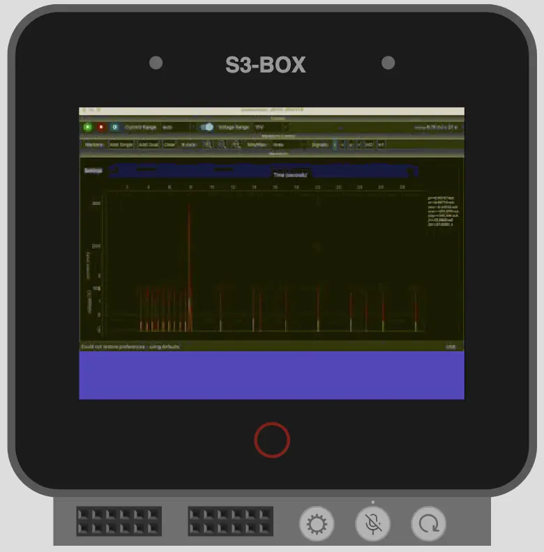

# Example of Theora video player with SDL3 for ESP32


## On-line Demo Simulation

[](https://wokwi.com/experimental/viewer?diagram=https%3A%2F%2Fraw.githubusercontent.com%2Fgeorgik%2Fesp32-theora-example%2Fmain%2Fboards%2Fesp-box%2Fdiagram.json&firmware=https%3A%2F%2Fgithub.com%2Fgeorgik%2Fesp32-theora-example%2Freleases%2Fdownload%2Fv1.0.0%2Fesp32-theora-example-esp-box.bin)

[Run the ESP32-P4 simulation with Wokwi.com](https://wokwi.com/experimental/viewer?diagram=https%3A%2F%2Fraw.githubusercontent.com%2Fgeorgik%2Fesp32-theora-example%2Fmain%2Fboards%2Fesp-box%2Fdiagram.json&firmware=https%3A%2F%2Fgithub.com%2Fgeorgik%2Fesp32-theora-example%2Freleases%2Fdownload%2Fv1.0.0%2Fesp32-theora-example-esp-box.bin)

## Requirements

`idf_component_manager` 2.x - install manually

## Build

```shell
git clone git@github.com:georgik/esp32-theora-test.git
cd esp32-theora-test

idf.py @boards/esp-box-3.cfg build
```

### Other boards

- ESP32-S3-BOX-3
```shell
idf.py @boards/esp-box-3.cfg build
```

- ESP32-S3-BOX (prior Dec. 2023)
```shell
idf.py @boards/esp-box.cfg build
```

- ESP32-P4
```shell
idf.py @boards/esp32_p4_function_ev_board.cfg build
```

- M5Stack-CoreS3
```shell
idf.py @boards/m5stack_core_s3.cfg build
```
